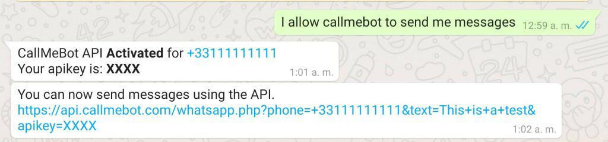
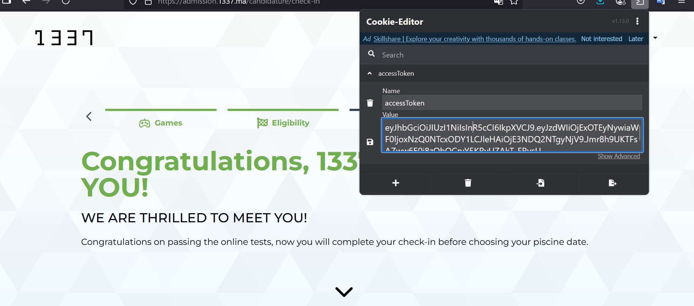
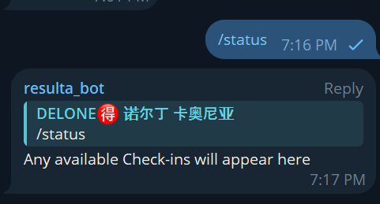

# 🛡️ 1337 Check-In Monitor Bot (2025 Edition)

A Python automation script that monitors [admission.1337.ma](https://admission.1337.ma/candidature/check-in) for open check-ins. It bypasses Cloudflare protections using `undetected_chromedriver`, logs in via a session cookie, and continuously refreshes the page to check for availability. Once a check-in is detected, it **spams you intentionally** with notifications on **Telegram** and **WhatsApp** to make sure you don’t miss it.

---

## 📦 Features

- ✅ **Cloudflare bypass** using stealth browser (via `undetected_chromedriver`)
- 🔄 Continuous page **auto-refresh**
- 📩 **Telegram notifications** via personal chat and optional group
- 📱 **WhatsApp notifications** via [CallMeBot](https://www.callmebot.com/)
- 🔐 Detects invalid/expired `accessToken` and alerts you to replace it
- 🧵 Telegram bot with `/status` command support
- 🚨 **Spams you with alerts** when a check-in is available, so you act fast

---

## 🚀 Installation

```bash
git clone https://github.com/nouredinekn/1337-checkin-monitor.git
cd 1337-checkin-monitor
pip install -r requirements.txt
```

> Or manually:
```bash
pip install undetected-chromedriver pyTelegramBotAPI requests
```

---

## ⚙️ Configuration

Create a file called `config.json` in the project root:

```json
{
  "EMAIL": "your_email_here",
  "callmebot.com": "https://api.callmebot.com/whatsapp.php?phone=[phone_number]&text=go+go+check+in&apikey=[your_apikey]",
  "ACCESS_TOKEN": "your_access_token_here",
  "TELEGRAM_ID": "your_telegram_chat_id",
  "TELEGRAM_ID_GROUP": "your_group_chat_id_if_needed",
  "TELEGRAM_BOT_TOKEN": "your_telegram_bot_token"
}
```


### Field Explanation

| Field                 | Description                                                  |
|----------------------|--------------------------------------------------------------|
| `EMAIL`              | Your 1337 account email (used to validate page content).     |
| `ACCESS_TOKEN`       | `accessToken` cookie value (see below).                      |
| `callmebot.com`      | WhatsApp CallMeBot link with your phone and API key.         |
| `TELEGRAM_ID`        | Your Telegram chat ID.                                       |
| `TELEGRAM_ID_GROUP`  | Telegram group ID (optional, for group-wide alerts).         |
| `TELEGRAM_BOT_TOKEN` | Token from Telegram's @BotFather.                            |

---

## 🧠 How It Works

1. Launches a stealth browser that **bypasses Cloudflare**
2. Injects your `accessToken` to log in
3. Continuously refreshes the check-in page
4. Detects:
   - **Token expiration** (email missing)
   - **New check-ins**
5. Sends alerts via:
   - 📬 Telegram (to you and optionally a group)
   - 📱 WhatsApp using CallMeBot
6. 🔁 **Keeps spamming you** with alerts while check-in is available (by design)

> The spamming stops once check-ins disappear or you close the script.

---
📸 **Example Screenshot callmebot.com**




## 🖼️ How to Get Your `ACCESS_TOKEN`

1. Install the [Cookie Editor browser extension](https://cookie-editor.com)
2. Visit: [https://admission.1337.ma/candidature/check-in](https://admission.1337.ma/candidature/check-in)
3. Click the Cookie Editor icon
4. Locate the `accessToken` cookie
5. Copy its value and paste it into your `config.json`

📸 **Example Screenshot   ACCESS_TOKEN:**



---

## 📬 Telegram Bot Usage to check [ bot is still working] 

Once running, you can send:

```bash
/status
```
📸 **Example Screenshot   status of bot:**


---


## 🧪 Run the Bot

```bash
python 1337_bot.py
```

The script starts the Telegram bot listener and browser monitor in parallel.

---


## vedio 4example
[vedio](https://github.com/user-attachments/assets/dfc42739-08ec-4551-b2cd-b7de6d3b3af8)


## ⚠️ Disclaimer

This script is intended for **educational** and **personal use only**. Misuse is your responsibility.  
Respect 1337.ma's terms and privacy policy.


